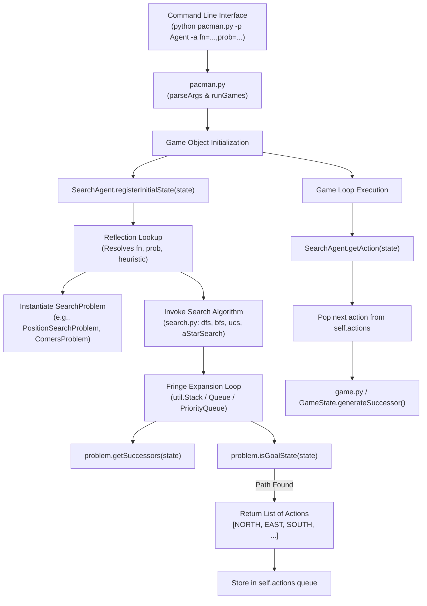

# Codebase Documentation

This document provides a comprehensive, structured technical reference for the Pac-Man AI Search codebase. It explains the system architecture, core search algorithms, state space formulations, heuristic design, utility data structures, and the end-to-end execution workflow.

---

## 1. System Architecture & End-to-End Execution Workflow

The Pac-Man AI Search codebase is decoupled into four primary layers:
1. **Game Infrastructure Layer (`pacman.py`, `game.py`)**: Manages game state, legal move validation, agent turns, scoring, and UI rendering.
2. **Agent Layer (`searchAgents.py`)**: Receives game state from the environment, formulates search problems, invokes search engines, and queues calculated actions for execution.
3. **Problem Formulation Layer (`searchAgents.py`, `eightpuzzle.py`)**: Defines domain-specific state representations, start states, goal tests, successor generators, and heuristic functions.
4. **Generic Search Engine Layer (`search.py`, `util.py`)**: Implements problem-agnostic graph search algorithms (DFS, BFS, UCS, A*) and foundational data structures (Stack, Queue, PriorityQueue).

### 1.1 Architecture Flowchart



---

## 2. Generic Search Engine & Abstract Problem Interface ([search.py])

`search.py` defines the abstract interface for search problems and implements four core graph search algorithms that operate independently of the underlying domain (Pac-Man mazes or 8-puzzle grids).

### 2.1 Abstract Class: `SearchProblem`

All search domains must inherit from `SearchProblem` and implement the following four methods:

#### 1. `getStartState(self) -> State`
- **Purpose**: Returns the initial search state for the problem.
- **Return Type**: Abstract state object (e.g., tuple `(x, y)` or `((x, y), visited_tuple)`).

#### 2. `isGoalState(self, state: State) -> bool`
- **Purpose**: Evaluates whether the given `state` satisfies the problem's goal criteria.
- **Return Type**: `bool` (`True` if goal reached, `False` otherwise).

#### 3. `getSuccessors(self, state: State) -> List[Tuple[State, Direction, float]]`
- **Purpose**: Expands `state` and generates all reachable next states.
- **Return Type**: A list of triples `(successor_state, action, stepCost)`:
  - `successor_state`: The resulting state after taking `action`.
  - `action`: The movement vector/direction (`Directions.NORTH`, `Directions.SOUTH`, etc.).
  - `stepCost`: Incremental cost of making the transition (float or int).

#### 4. `getCostOfActions(self, actions: List[Direction]) -> float`
- **Purpose**: Calculates the total accumulated cost of executing a sequence of actions from start.
- **Return Type**: `float` (Returns `999999` if any action in the sequence is illegal).

---

### 2.2 Search Algorithms

All search functions in `search.py` implement **Graph Search** semantics, keeping track of a `visited` set to prevent infinite loops and redundant state expansions.

```python
# Shared Graph-Search Pattern
fringe = Structure()          # Stack, Queue, or PriorityQueue
visited = set()
fringe.push((start_state, []))

while not fringe.isEmpty():
    state, actions = fringe.pop()
    if problem.isGoalState(state):
        return actions
    if state not in visited:
        visited.add(state)
        for successor, action, stepCost in problem.getSuccessors(state):
            if successor not in visited:
                fringe.push((successor, actions + [action]))
```

#### 1. `depthFirstSearch(problem: SearchProblem) -> List[Directions]`
- **Data Structure**: `util.Stack` (LIFO - Last-In, First-Out).
- **Strategy**: Explores the deepest unvisited node in the search tree first.
- **Properties**: Not guaranteed to find optimal paths (can return long paths even on simple layouts).

#### 2. `breadthFirstSearch(problem: SearchProblem) -> List[Directions]`
- **Data Structure**: `util.Queue` (FIFO - First-In, First-Out).
- **Strategy**: Explores shallowest unvisited nodes level-by-level.
- **Properties**: Guaranteed optimal for unweighted graphs (where step cost $c = 1$).

#### 3. `uniformCostSearch(problem: SearchProblem) -> List[Directions]`
- **Data Structure**: `util.PriorityQueue` (Min-heap ordered by path cost $g(n)$).
- **Strategy**: Expands the node with the lowest cumulative path cost $g(n) = \sum \text{stepCost}$.
- **Properties**: Guaranteed optimal for general non-negative step cost functions.

#### 4. `aStarSearch(problem: SearchProblem, heuristic=nullHeuristic) -> List[Directions]`
- **Data Structure**: `util.PriorityQueue` (Min-heap ordered by evaluation function $f(n) = g(n) + h(n)$).
- **Strategy**: Expands the node minimizing the estimated total cost through node $n$ to goal.
  - $g(n)$: Accumulated path cost from start state to state $n$.
  - $h(n)$: Estimated cost from state $n$ to nearest goal state.
- **Properties**: Guaranteed optimal when $h(n)$ is admissible ($h(n) \le h^*(n)$) for tree search or consistent ($h(n) \le c(n, a, n') + h(n')$) for graph search.

---

## 3. Data Structures & Utilities ([util.py])

`util.py` provides optimized data structures and helper utilities used throughout the search engine and heuristics.

### 3.1 Data Structures

| Class Name | Underlying Mechanism | Key Methods | Description & Usage |
| :--- | :--- | :--- | :--- |
| `Stack` | Python `list` | `push(item)`, `pop()`, `isEmpty()` | Standard LIFO container used in DFS fringe expansion. |
| `Queue` | Python `list` | `push(item)`, `pop()`, `isEmpty()` | Standard FIFO container (`insert(0, item)` and `pop()`) used in BFS fringe expansion. |
| `PriorityQueue` | Python `heapq` (Binary Heap) | `push(item, priority)`, `pop()`, `update(item, priority)`, `isEmpty()` | Min-heap storing `(priority, count, item)` triples. Guarantees $O(\log N)$ insertions and $O(1)$ minimum retrieval for UCS and A*. |
| `PriorityQueueWithFunction` | Inherits `PriorityQueue` | `push(item)` | Wrapper that automatically evaluates `priorityFunction(item)` to assign item priority. |
| `Counter` | Inherits Python `dict` | `argMax()`, `sortedKeys()`, `totalCount()` | Dictionary extension where missing keys default to `0`. Useful for tallying occurrences and scores. |

### 3.2 Key Utility Functions

#### `manhattanDistance(xy1: Tuple[int, int], xy2: Tuple[int, int]) -> int`
Computes the Manhattan (L1) distance between two grid coordinates $(x_1, y_1)$ and $(x_2, y_2)$:
$$D_{\text{Manhattan}} = |x_1 - x_2| + |y_1 - y_2|$$

---

## 4. Problem Formulations & Domains ([searchAgents.py])

`searchAgents.py` translates concrete Pac-Man environment states into formal `SearchProblem` representations.

### 4.1 `PositionSearchProblem`
Used for finding a path to a single target coordinate $(x_{goal}, y_{goal})$ in a maze layout.

- **State Representation**: Single coordinate tuple `(x, y)`.
- **Start State**: Pac-Man's starting coordinate `gameState.getPacmanPosition()`.
- **Goal Test**: `state == self.goal`.
- **Successor Function**: Moves North, South, East, West into non-wall tiles. Step cost is determined by `costFn(nextState)` (defaults to $1$).

### 4.2 `CornersProblem` (Question 5)
Formulated to solve the problem of navigating Pac-Man to visit all four layout corners in minimum total steps.

- **State Representation**: Tuple `((x, y), (c0_visited, c1_visited, c2_visited, c3_visited))` where:
  - `(x, y)`: Current Pac-Man coordinate.
  - `(c0, c1, c2, c3)`: Tuple of 4 booleans tracking whether corner $0, 1, 2, 3$ has been visited.
- **Start State**: `(startingPosition, (False, False, False, False))` (or `True` if start position is a corner).
- **Goal Test**: `all(visited)` (returns `True` only when all 4 corner booleans are `True`).
- **Successor Function**:
  ```python
  for action in [NORTH, SOUTH, EAST, WEST]:
      nextx, nexty = int(x + dx), int(y + dy)
      if not self.walls[nextx][nexty]:
          new_visited = list(visited)
          for i, corner in enumerate(self.corners):
              if (nextx, nexty) == corner:
                  new_visited[i] = True
          successors.append((((nextx, nexty), tuple(new_visited)), action, 1))
  ```

### 4.3 `FoodSearchProblem` (Question 7)
Formulated to collect all remaining food dots in a maze layout.

- **State Representation**: Tuple `(pacmanPosition, foodGrid)` where:
  - `pacmanPosition`: Coordinate tuple `(x, y)`.
  - `foodGrid`: 2D Boolean `Grid` instance marking remaining food coordinates (`True` if food present, `False` otherwise).
- **Start State**: `(startingGameState.getPacmanPosition(), startingGameState.getFood())`.
- **Goal Test**: `state[1].count() == 0` (no food remaining on the grid).
- **Successor Function**: For every legal movement into a non-wall space `(nextx, nexty)`, generates `nextFood = foodGrid.copy()`, sets `nextFood[nextx][nexty] = False`, and returns successor state `(((nextx, nexty), nextFood), action, 1)`.

---

## 5. Heuristic Functions ([searchAgents.py])

Heuristics estimate the remaining cost from a search state $s$ to the nearest goal state.

### 5.1 Single-Goal Heuristics
- **`manhattanHeuristic(position, problem)`**: $|x_{pos} - x_{goal}| + |y_{pos} - y_{goal}|$. Admissible and consistent for grid mazes.
- **`euclideanHeuristic(position, problem)`**: $\sqrt{(x_{pos} - x_{goal})^2 + (y_{pos} - y_{goal})^2}$. Straight-line distance lower bound.

---

### 5.2 `cornersHeuristic(state, problem)` (Question 6)

Computes an admissible lower bound for visiting all remaining unvisited corners from current state `(position, visited)`.

#### Algorithm:
1. Extract unvisited corner coordinates: `unvisited = [corners[i] for i in range(4) if not visited[i]]`.
2. If `unvisited` is empty, return `0`.
3. Compute the total Manhattan path length for all possible orderings (permutations) of `unvisited` corners, starting from Pac-Man's current position:
   $$\text{cost}(\pi) = D_{\text{Manhattan}}(pos, \pi_0) + \sum_{i=0}^{|\pi|-2} D_{\text{Manhattan}}(\pi_i, \pi_{i+1})$$
4. Return the minimum cost across all permutations: $\min_{\pi} \text{cost}(\pi)$.

#### Admissibility Proof:
Any physical path that visits all remaining unvisited corners must traverse at least the straight-line Manhattan distances connecting those corners in *some* order. Thus, $\min_{\pi} \text{cost}(\pi) \le h^*(s)$ is a strict lower bound.

---

### 5.3 `foodHeuristic(state, problem)` & `mazeDistance` (Question 7)

Computes an admissible and consistent heuristic for collecting all remaining food dots on `FoodSearchProblem`.

#### Algorithm:
1. Extract list of remaining food coordinates: `food_list = state[1].asList()`.
2. If `food_list` is empty, return `0`.
3. Retrieve or initialize the cache dictionary `distances = problem.heuristicInfo['distances']`.
4. Iterate through all remaining food dots $f \in \text{food\_list}$:
   - Check if `(position, f)` is in `distances`.
   - If not cached, compute exact maze distance using `mazeDistance(position, f, startingGameState)` and store it in `distances`.
5. Return the maximum maze distance found:
   $$h(s) = \max_{f \in \text{food\_list}} \text{mazeDistance}(pos, f)$$

#### Helper: `mazeDistance(point1, point2, gameState)`
Executes a fast BFS search on a `PositionSearchProblem` from `point1` to `point2` on the maze layout and returns the exact number of steps required:
```python
prob = PositionSearchProblem(gameState, start=point1, goal=point2, warn=False, visualize=False)
return len(search.bfs(prob))
```

#### Admissibility & Consistency Proofs:
- **Admissibility**: To clear all food, Pac-Man must at least reach the single farthest food dot. The true cost $h^*(s)$ to eat all dots must be $\ge$ the maze distance to the single farthest dot.
- **Consistency**: Moving 1 step to an adjacent cell can change the maze distance to any food dot by at most $1$. Therefore, $h(s) - h(s') \le c(s, a, s') = 1$.

---

## 6. Agents & Control Flow ([searchAgents.py])

`SearchAgent` acts as the primary driver connecting Python search routines to the Pac-Man environment.

### 6.1 `SearchAgent` Class Mechanics

1. **`__init__(self, fn, prob, heuristic)`**:
   Uses Python reflection (`dir()`, `getattr()`, `globals()`) to dynamically bind:
   - `self.searchFunction`: Resolved from `search.py` (e.g., `search.aStarSearch`).
   - `self.searchType`: Resolved from `searchAgents.py` (e.g., `CornersProblem`).
   - Pairs search algorithm with heuristic using lambda wrappers if applicable: `lambda prob: func(prob, heuristic=heur)`.

2. **`registerInitialState(self, state)`**:
   Called once before game start when Pac-Man first sees the layout:
   - Instantiates search problem: `problem = self.searchType(state)`.
   - Executes search algorithm: `self.actions = self.searchFunction(problem)`.
   - Stores action sequence in `self.actions` list.
   - Logs performance statistics (Path cost, runtime seconds, search nodes expanded).

3. **`getAction(self, state)`**:
   Called every tick by `game.py`:
   - Sequential playback of stored action list `self.actions`:
     ```python
     if self.actionIndex < len(self.actions):
         action = self.actions[self.actionIndex]
         self.actionIndex += 1
         return action
     return Directions.STOP
     ```

### 6.2 Specialized Agents Summary Table

| Agent Class Name | Search Problem Class | Search Algorithm | Heuristic Function | Purpose |
| :--- | :--- | :--- | :--- | :--- |
| `SearchAgent` | `PositionSearchProblem` | Default: `dfs` | `nullHeuristic` | Generic baseline agent for navigating to single goal position `(1,1)`. |
| `StayEastSearchAgent` | `PositionSearchProblem` | `ucs` | None | Penalizes Western positions with cost $0.5^x$. |
| `StayWestSearchAgent` | `PositionSearchProblem` | `ucs` | None | Penalizes Eastern positions with cost $2^x$. |
| `AStarCornersAgent` | `CornersProblem` | `aStarSearch` | `cornersHeuristic` | Finds shortest path to visit all 4 maze corners using A*. |
| `AStarFoodSearchAgent` | `FoodSearchProblem` | `aStarSearch` | `foodHeuristic` | Finds shortest path to collect all food dots using A*. |

---

## 7. Game Infrastructure & Environment ([pacman.py])

`pacman.py` and `game.py` maintain environmental rules, object state encapsulation, collision detection, and score tracking.

### 7.1 Key Infrastructure Classes

```
+-------------------------------------------------------------+
|                          GameState                          |
|  - getPacmanPosition() : (x, y)                             |
|  - getFood() : Grid                                         |
|  - getWalls() : Grid                                        |
|  - getLegalPacmanActions() : [NORTH, SOUTH, ...]            |
|  - generateSuccessor(agentIndex, action) : GameState        |
+-------------------------------------------------------------+
                               |
                               v
+-------------------------------------------------------------+
|                            Game                             |
|  - state : GameState                                        |
|  - agents : [SearchAgent, GhostAgent1, ...]                 |
|  - run() : Main execution loop                              |
+-------------------------------------------------------------+
```

- **`GameState` (`pacman.py`)**: Wraps immutable game state accessor methods (`getPacmanPosition()`, `getFood()`, `getWalls()`, `isWin()`, `isLose()`).
- **`GameStateData` (`game.py`)**: Stores low-level layout details, food matrix, agent configurations, score changes.
- **`Agent` (`game.py`)**: Abstract base class defining `getAction(state)`.
- **`Actions` (`game.py`)**: Vector arithmetic helper converting movement directions into grid offsets:
  - `NORTH` $\to (0, 1)$
  - `SOUTH` $\to (0, -1)$
  - `EAST` $\to (1, 0)$
  - `WEST` $\to (-1, 0)$
- **`Grid` (`game.py`)**: 2D boolean array representing maze walls and food dot presence.

---

## 8. Eight-Puzzle Domain Adaptation ([eightpuzzle.py])

`eightpuzzle.py` proves the domain-independence of `search.py` algorithms by adapting the 8-puzzle sliding-tile game into the `SearchProblem` interface.

### 8.1 Key Classes

#### 1. `EightPuzzleState`
- **Internal Storage**: 3x3 list of lists `cells` containing integers `0` to `8` (`0` represents the blank space).
- **Methods**:
  - `legalMoves()`: Returns list of legal tile slides (`'up'`, `'down'`, `'left'`, `'right'`).
  - `result(move)`: Returns a new `EightPuzzleState` with the blank space swapped.
  - `isGoal()`: Checks if tiles match `[[0, 1, 2], [3, 4, 5], [6, 7, 8]]`.
  - `__eq__` & `__hash__`: Overloaded to allow state deduplication in `visited` sets.

#### 2. `EightPuzzleSearchProblem(SearchProblem)`
- **Adapter pattern**: Maps `EightPuzzleState` methods to `SearchProblem` interface:
  - `getStartState()` $\to$ Initial `EightPuzzleState`.
  - `isGoalState(state)` $\to$ `state.isGoal()`.
  - `getSuccessors(state)` $\to$ Returns `[(state.result(move), move, 1) for move in state.legalMoves()]`.

---

## 9. Comprehensive Function & Method Directory

| Module File | Function / Method Name | Inputs | Output / Return Type | Description |
| :--- | :--- | :--- | :--- | :--- |
| `search.py` | `depthFirstSearch` | `problem` | `List[Directions]` | LIFO graph search. |
| `search.py` | `breadthFirstSearch` | `problem` | `List[Directions]` | FIFO graph search. |
| `search.py` | `uniformCostSearch` | `problem` | `List[Directions]` | PriorityQueue g(n) graph search. |
| `search.py` | `aStarSearch` | `problem, heuristic` | `List[Directions]` | PriorityQueue f(n) = g(n) + h(n) graph search. |
| `util.py` | `PriorityQueue.push` | `item, priority` | `None` | Inserts item into min-heap. |
| `util.py` | `manhattanDistance` | `xy1, xy2` | `int` | Grid distance between two points. |
| `searchAgents.py` | `CornersProblem.__init__` | `startingGameState` | `None` | Formulates corners state & goal. |
| `searchAgents.py` | `cornersHeuristic` | `state, problem` | `float` | Minimum Manhattan corner permutation distance. |
| `searchAgents.py` | `foodHeuristic` | `state, problem` | `float` | Maximum BFS maze distance to remaining food. |
| `searchAgents.py` | `mazeDistance` | `point1, point2, gameState` | `int` | Computes exact shortest maze distance between points via BFS. |
| `eightpuzzle.py` | `EightPuzzleSearchProblem` | `puzzleState` | `SearchProblem` | Adapter enabling 8-puzzle search in `search.py`. |

